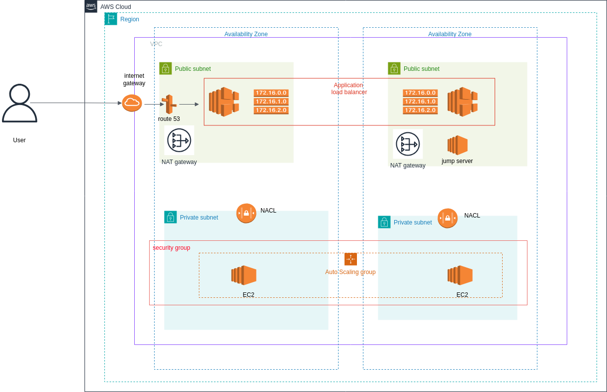

# Terraform-Project-Gallery

* Industry grade terraform project collection using aws cloud

### Project 1: AWS Private/Public Subnet Application Deployment



* concept: 

When deploying within a public cloud solution provider, we consistently prioritize the security aspect. AWS has presented the reference architecture outlined below for secure project deployment, wherein our primary application is secured within a private subnet, with all internet traffic being managed through the public subnet and application load balancer. To address scalability concerns, EC2 instances are instantiated through the use of an auto-scaling group.

- The public subnet is exposed to the internet via an internet gateway, and internet traffic is managed through the application load balancer.

- Routing of public to private traffic is handled through routing tables.

- NAT gateways provide IP masking for the application server when communication with the external world is required.

- Security groups, which are stateful, are employed to manage instance-level inbound and outbound traffic.

- Network Access Control Lists (NACL) operate in a stateless manner and govern inbound and outbound traffic within the subnet boundary.

> check ```aws-vpc``` folder for the terraform codebase. 

folder structure 
```
├── aws-private-subnet-vm.drawio
├── aws-private-subnet-vm.png
├── aws-vpc
├── demerzelAI-bot.pem
└── vpc-terraform
    ├── main.tf
    ├── outputs.tf
    ├── provider.tf
    ├── terraform.tfstate
    ├── terraform.tfstate.backup
    ├── terraform.tfvars
    └── variables.tf
```

details about aws modules used :

### 1. VPC 

```yaml
module "vpc" {
  source          = "terraform-aws-modules/vpc/aws"
  name            = <VPC Name>
  cidr            = <VPC cidr block>
  azs             = local.azs
  private_subnets = [for k, v in local.azs : cidrsubnet(var.vpc_cidr, 8, k)]     #private subnet (secure application)
  public_subnets  = [for k, v in local.azs : cidrsubnet(var.vpc_cidr, 8, k + 4)] # public subnet (intenet facing)

  # define NAT Gateway (one NAT per AZ)
  enable_nat_gateway     = true
  single_nat_gateway     = false
  one_nat_gateway_per_az = true

  #define DNS specifications
  enable_dns_hostnames = true
  enable_dns_support   = true

  # define tags
  tags = local.tags

  # VPC Flow Logs (Cloudwatch log group and IAM role will be created)
  enable_flow_log                      = true
  create_flow_log_cloudwatch_log_group = true
  create_flow_log_cloudwatch_iam_role  = true
  flow_log_max_aggregation_interval    = 60
}
```

important :

1. Define a CIDR block for the VPC and allocate multiple Availability Zones (AZs) within the region for enhanced high availability.

2. Define CIDR blocks for both private and public subnets.

3. To ensure the security of the application server, implement a strategy to mask the server's IP when communicating with the external world. Attach a NAT gateway to each Availability Zone (AZ) to facilitate secure communication.

4. Create VPC flow logs to monitor and analyze the traffic flow within the VPC.


### 2. Security Group

```yaml

module "security_group" {

  source      = "terraform-aws-modules/security-group/aws"
  name        = <SG Name>
  description = "security group with defined rules"

  # attach the above created vpc into SG
  vpc_id = module.vpc.vpc_id

  # ingress rules for cidr blocks (allow only port 8000,80 port traffic)
  ingress_with_cidr_blocks = [
    {
      cidr_blocks = "0.0.0.0/0"
      from_port   = 8000
      to_port     = 8000
      protocol    = "tcp"
      description = "custom python server firewall rule"
    },

    {
      cidr_blocks = "0.0.0.0/0"
      rule        = "http-80-tcp"
      description = "http request firewall rule"
    }

  ]

  # define egress rules (allow all the traffic)
  egress_rules = ["all-all"]

  tags = local.tags
}
```

important:

1. Associate the VPC with a security group and enforce security rules specifically for traffic within the VPC.

2. Establish inbound and outbound security rules, enabling the restriction of IP ranges and ports. Permit incoming traffic on port 8000 from the internet and allow port 80 for HTTP web traffic (```for the Application Load Balancer```). The default AWS configuration permits all outbound traffic, and it is acceptable to maintain this setting, given the configuration of NAT gateways within the public subnets.


